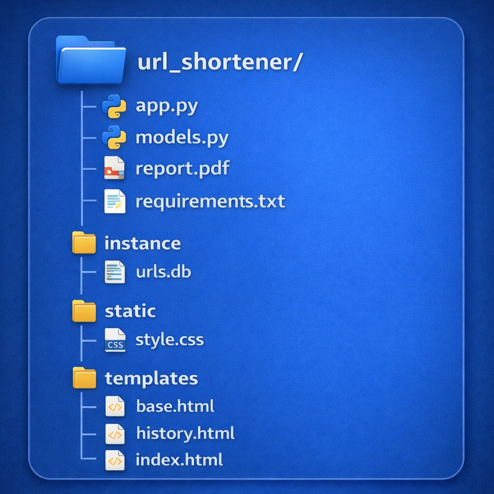

# 🔗 URL Shortener Web Application (Flask)

A simple and efficient **URL Shortener Web Application** built using **Flask** and **SQLAlchemy**.  
This application allows users to shorten long URLs, store them in a database, and view their URL history.

---

## 📌 Project Overview

Long URLs are often difficult to share and manage. This project provides a solution by converting long URLs into short, easy-to-share links while maintaining a history of all shortened URLs.

The application is developed as a **full-stack web project**, integrating frontend design, backend logic, and database management.

---

## 🎯 Features

- 🔗 Shortens long URLs into compact links  
- ✅ Validates URLs before shortening  
- 🗄️ Stores original and shortened URLs in a database  
- 📜 History page to view previously shortened URLs  
- 📋 One-click copy functionality  
- 🔁 Automatic redirection from short URL to original URL  
- 🎨 Responsive UI using Bootstrap  

---

## 🛠️ Tech Stack

### Frontend
- HTML  
- CSS  
- Bootstrap  

### Backend
- Python  
- Flask  

### Database
- SQLite  
- Flask-SQLAlchemy (ORM)

---

## 📂 Project Structure




---

## ⚙️ Installation & Setup

### 1️⃣ Clone the Repository
```bash
git clone https://github.com/your-username/url-shortener-flask.git
cd url-shortener-flask
```

### 2️⃣ Create Virtual Environment (Optional but Recommended)

```bash
python -m venv venv
source venv/bin/activate  # On Windows: venv\Scripts\activate
```

### 3️⃣ Install Dependencies
```bash
pip install -r requirements.txt
```

### ▶️ Run the Application
```bash
python app.py
```

Open your browser and visit:

```bash
http://127.0.0.1:5000
```

## 🔄 How It Works

1. The user enters a long URL on the home page.
2. The application validates the URL for correctness.
3. A unique short code is generated for the entered URL.
4. The original URL and its short code are stored in the database.
5. The shortened URL is displayed to the user.
6. When the shortened URL is visited, the user is redirected to the original URL.
7. All previously shortened URLs are displayed on the History page.

---

## 🗃️ Database Design

The application uses a relational database to store URL mappings.

### Database Fields:
- **ID** – Primary key for each record  
- **Original URL** – Stores the long URL entered by the user  
- **Short Code** – Unique identifier used for redirection  
- **Timestamp** – Records when the URL was created  

The project uses **ORM (Flask-SQLAlchemy)** to simplify database operations, improve code readability, and ensure secure interaction with the database.

## 🚧 Challenges & Solutions

### Challenges

- Generating unique short URLs
- Validating URL formats
- Handling redirection logic

### Solutions

- Random alphanumeric short code generation
- URL validation before database insertion
- Flask routing for redirection

### 📈 Future Enhancements

- User authentication
- Click analytics
- Custom short URLs
- URL expiration
- Cloud deployment

### 📚 Learning Outcomes

- Full-stack development using Flask
- Backend routing and form handling
- Database integration using ORM
- URL validation techniques
- Frontend–backend integration

### 🙏 Acknowledgement

Thanks to Innomatics Research Labs for the guidance and hands-on learning support that helped in building this project.

### 📌 Author

**Kesava Pavan Gadde**
**Backend / Python Developer**
